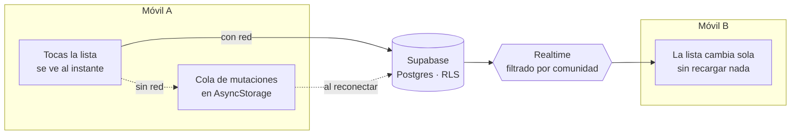

<div align="center">


# Lista de la compra colaborativa

**Una lista, varias personas, en tiempo real.**
Se entra con un código de invitación y un nombre. Sin registro y sin contraseñas.


</div>

---

## Qué resuelve

Dos personas en la misma casa apuntan la compra en el mismo papel. Dos personas en países
distintos, no. Esta app es ese papel compartido: **una sola lista por comunidad**, que todos ven
igual y a la vez, aunque estén en redes y husos horarios diferentes.

El precio de entrada es cero a propósito. Nadie va a crearse una cuenta para apuntar «leche», así
que no hay cuentas: alguien crea la lista, comparte un código de seis caracteres y el resto entra
escribiendo su nombre. La sesión es anónima y la seguridad la ponen las políticas de la base de
datos, no un formulario de registro.

## Cómo funciona

Los móviles **no hablan entre sí**. Todos hablan con el mismo backend, y por eso da igual la red o
el país en el que esté cada uno.



Cada pantalla pinta el cambio antes de que el servidor conteste y lo deshace si falla. Sin
cobertura, la mutación se guarda en disco y se reenvía al volver la red, y sobrevive a que cierres
la app del todo. Eso último es lo que obliga a que **el id de un artículo lo genere el móvil**, no
el servidor: si no, un cambio hecho en la misma sesión sin conexión apuntaría a una fila que
todavía no existe.

## Arranque

Necesitas Node 22+, un `.env` con las claves de Supabase (los nombres están en `.env.example`) y
un móvil con **Expo Go 54**. La versión del SDK está fijada: Expo Go solo abre proyectos de su
misma major.

```bash
npm install
npx expo start            # QR para Expo Go
npx expo start --tunnel   # si el móvil y el PC no comparten Wi-Fi
```

## Comandos

| Comando                              | Qué hace                                                            |
| ------------------------------------ | ------------------------------------------------------------------- |
| `npm run lint`                       | ESLint sobre `src/`                                                 |
| `npm run typecheck`                  | `tsc --noEmit`, TypeScript en modo estricto                         |
| `npm test`                           | Jest. Dominio y repositorios por encima del 70% de cobertura        |
| `npm run test:rls`                   | Aislamiento entre comunidades contra el proyecto real. Da **27/27** |
| `npm run test:realtime`              | Eventos, filtro por comunidad y presencia. Da **12/12**             |
| `npm run test:e2e`                   | Maestro sobre el APK instalado. Necesita `adb` y el CLI de Maestro  |
| `npm run users`                      | Cuántos usuarios anónimos hay y cuáles quedaron huérfanos           |
| `npx expo export --platform android` | Comprobación de build por defecto                                   |

`test:rls` no es opcional. Comprueba que un usuario no puede leer ni escribir datos de otra
comunidad, que es el requisito de seguridad que sostiene todo lo demás. Pásalo después de tocar
cualquier política o función de Postgres.

## Estructura

```text
src/
├── app/            rutas de Expo Router
├── features/       una carpeta por feature, autocontenida
│   └── <feature>/
│       ├── domain/         entidades y casos de uso. Sin React y sin Supabase
│       ├── data/           el puerto y su adaptador de Supabase
│       └── presentation/   pantallas, componentes y hooks de TanStack Query
├── shared/         design system, cliente de Supabase, i18n, utilidades
└── theme/          tokens de color, espaciado, tipografía y radios
```

La regla que sujeta el reparto: `domain/` no importa nada de React ni de Supabase, así que los
casos de uso son funciones puras y se prueban en Node. Cambiar de backend sería escribir otro
adaptador en `data/`, sin tocar una línea de dominio.

Fuera de `src/`, cada carpeta de la raíz tiene un trabajo: `docs/` la documentación, `scripts/` las
herramientas de línea de comandos que no entran en el bundle, y `supabase/` las migraciones.

## Decisiones que dan forma al proyecto

Ninguna decisión vive solo en la cabeza de alguien. Estas son las que más condicionan el código:

| ADR                                                                 | Decisión                                            | Por qué importa                                                          |
| ------------------------------------------------------------------- | --------------------------------------------------- | ------------------------------------------------------------------------ |
| [0002](docs/adr/ADR-0002-modelo-de-sesion-y-rls.md)                 | Sesión anónima y RLS por función `security definer` | Sin cuentas pero con aislamiento real. Tiene dos trampas contadas        |
| [0004](docs/adr/ADR-0004-libreria-de-ui.md)                         | NativeWind propio, Paper solo para overlays         | El aspecto es nuestro; de la librería solo lo accesible que cuesta       |
| [0008](docs/adr/ADR-0008-persistencia-local-de-la-cache.md)         | AsyncStorage y no MMKV                              | MMKV es nativo y no arranca en Expo Go, que es como se prueba esto       |
| [0009](docs/adr/ADR-0009-cola-de-mutaciones-offline.md)             | Cola con `setMutationDefaults`                      | Una función no se serializa. Al rehidratar solo quedan variables         |
| [0010](docs/adr/ADR-0010-id-del-articulo-generado-en-el-cliente.md) | El id del artículo lo pone el móvil                 | Un alta offline y su edición posterior tienen que apuntar al mismo sitio |
| [0011](docs/adr/ADR-0011-caducidad-y-rotacion-del-join-code.md)     | El código de invitación caduca y se puede rotar     | Es el único secreto que protege una lista                                |

Los doce, con su estado, en [`docs/README.md`](docs/README.md). Un ADR no se edita para cambiar de
opinión: se escribe uno nuevo que supersede al viejo.

## Accesibilidad

No es una capa que se añade al final. Cada control lleva `accessibilityLabel` y
`accessibilityRole`, área táctil de 44 pt como mínimo y contraste AA. Ningún estado se comunica
solo con color: «comprado» lleva icono y texto además del tachado. La app respeta el tamaño de
fuente del sistema y el modo claro y oscuro desde los tokens.

Lo que un test no puede ver, que es si lo que se lee en voz alta tiene sentido y en el orden bueno,
se comprueba a mano con TalkBack antes de publicar.

## Seguridad

- La clave que viaja en la app es la **publishable key**. Es pública por diseño; quien protege los
  datos es RLS.
- La **secret key** se salta RLS. Nunca en el cliente, nunca en el repo y nunca en una variable con
  prefijo `EXPO_PUBLIC_`.
- `.env` está en `.gitignore`. `.env.example` lleva los nombres sin valores.
- El código de invitación evita caracteres ambiguos (`O/0`, `I/1`), caduca a los siete días,
  cualquier miembro puede rotarlo y unirse tiene rate limit.

## Estado

**Fase 5, endurecimiento antes de publicar.** El MVP está cerrado y probado con dos móviles reales.
De la fase en curso quedan verificados en dispositivo el id generado en el cliente y la rotación
del código; falta la pasada con TalkBack.

Se distribuye como APK con EAS Build y se parchea por aire con `eas update`. La versión que corre
en el móvil se lee al pie de la pantalla de lista, que es la forma rápida de saber si un cambio
llegó de verdad al dispositivo.

Lo que está registrado y todavía no se ha construido: exportar la lista a PDF, reparto de gastos y
catálogo de productos de supermercado. Los tres viven en el documento maestro con su motivo para
esperar.

## Documentación

| Quieres...                                   | Vete a                                                                 |
| -------------------------------------------- | ---------------------------------------------------------------------- |
| Entender qué es y qué se va a construir      | [`docs/especificacion-y-roadmap.md`](docs/especificacion-y-roadmap.md) |
| Saber **por qué** algo está hecho así        | [`docs/adr/`](docs/adr/)                                               |
| Ver qué se hizo en cada fase y cómo probarlo | [`docs/phases/`](docs/phases/)                                         |
| Hacer una tarea concreta paso a paso         | [`docs/guias/`](docs/guias/)                                           |
| Las reglas duras del proyecto                | [`CLAUDE.md`](CLAUDE.md)                                               |

---

<div align="center">
<sub>Proyecto privado en beta. Documentación en español, código en inglés.</sub>
</div>
